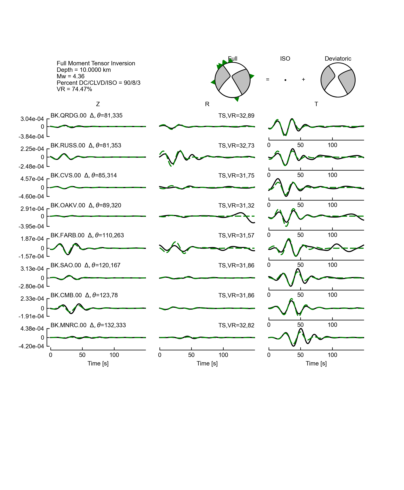

.. _user_guide:

==========
User Guide
==========

The user guide covers the inverse routine and file structure. Users brand new
to moment tensor inversion should check out the Jupyter Notebook
`tutorials <https://github.com/LLNL/mttime/tree/master/examples/notebooks>`_
for an complete example that includes data processing and synthetics calculation.

Further information on any specific method can be obtained in the :ref:`api`.

Basics
------
The inverse routine is divided into three main parts:

1. Parsing an input file to get a set of parameters required to run the inversion.
2. Perform the inversion based on the parameters provided.
3. Write the results to file.

.. code-block:: python

   >>> # import the package
   >>> import mttime

   >>> # 1. read input file and set up the inversion
   >>> config = mttime.Configure(path_to_file="mtinv.in") 
   >>> mt = mttime.Inversion(config=config)

   >>> # 2. Run inversion and plot the result (if plotting function is turned on)
   >>> mt.invert()

   >>> # 3. Save result to file
   >>> mt.write()

We will go over the details in the following sections.

.. _dataset:

Dataset
-------

In this section we will introduce the file structure and input parameters using an example.
The earthquake in this example occured near Byron, California on July 16, 2019. The raw data
and instrument response were obtained from the `IRIS DMC <https://ds.iris.edu/ds/nodes/dmc/>`_
using ObsPy's `mass_downloader functionality <https://docs.obspy.org/packages/autogen/obspy.clients.fdsn.mass_downloader.html>`_.

Directory and file structures
^^^^^^^^^^^^^^^^^^^^^^^^^^^^^

In this example all of the files (input, data and synthetics) are assumed to be located under
a single root directory called **project**:

.. code-block:: text

   project
   |    mtinv.in
   |
   |____40191336
   |    |  BK.QRDG.00.z.dat
   |    |  BK.RUSS.00.z.dat
   |    |  ...
   |
   |____40191336/gil7
        |  BK.QRDG.00.12.0000.ZDD
        |  BK.QRDG.00.12.0000.ZDS
        |  ...

Under project there is the input parameter file **mtinv.in** which contains
headers and a station table:

.. literalinclude:: example/mtinv.in
   :language: text

:class:`~mttime.core.configure.Configure` object will parse the input
text file.

.. code-block:: python

   >>> config = mttime.Configure(path_to_file="mtinv.in")

The headers have two columns: a parameter name and its corresponding value. If the values are left blank,
the default values will be used instead. A descrption of the parameters are shown here:

.. cssclass: table-striped

=============    =====================================================================================
parameters       description
=============    =====================================================================================
path_to_file     path to input file containing headers and station information.
                 Directory will become the project root directory. Default is ``"./mtinv.in"``.
datetime         event origin time, optional.
longitude        event longitude, optional.
latitude         event latitude, optional.
depth            source depths to invert.
path_to_data     path to data files, relative to root directory.
                 Defaults is ``"./"``.
path_to_green    path to Green's function files, relative to root directory.
                 Defaults is ``"./"``.
green            Green's function format, options are ``"herrmann"`` or ``"tensor"``.
                 Defaults to ``"herrmann"``.
components       waveform components, options are ``"Z"`` for vertical component,
                 or ``"ZRT"`` for three-component data in vertical, radial and transverse components.
                 Defaults to ``"ZRT"``.
degree           degrees of freedom allowed in the inversion, options are ``5`` for deviatoric
                 or ``6`` for full. Defaults to ``5``.
weight           data weights, options are ``"none"``, ``"distance"`` or ``"variance"``
                 for no weights, inverse distance, or inverse variance, respectively.
                 Defaults to ``"none"``.
plot             If ``True`` will plot the solution and waveform fits. Default is ``False``.
correlate        Flag to cross-correlate data and Green's functions
                 for best time shift in time points. Default is ``False``.
=============    =====================================================================================

.. rubric:: Station table

Lines 13 and onward in **mtinv.in** contain the station information, line 13 is the station header 
and should not be modified. A description of the headers is shown here:

.. cssclass:: table-striped

=========    ===========================================================================================
headers      description
=========    ===========================================================================================
station      file names of data and synthetics
distance     source-receiver distance
azimuth      source-receiver azimuth
ts           shift data by the number of time points specified
npts         number of samples to invert
dt           sampling interval in seconds
used         components to invert, set 1 to invert and 0 for prediction only. For three component data
             you can set flags for individual components, ordered by ZRT.
             e.g. 110 will invert ZR components only
longitude    station longitude
latitude     station latitude
=========    ===========================================================================================

Waveform Data
^^^^^^^^^^^^^

mttime expects both observed and synthetic Green's functions to be fully processed. 
This means they are corrected for instrument response, filtered, and decimated, 
and saved as SAC binary files.

The data file names have the following format:

[``station``].[``component``].dat

* station: from the station column
* component: Z, R, or T (from the components parameter)

With the example above the data file names for station BK.CMB.00 are:

* BK.CMB.00.Z.dat
* BK.CMB.00.R.dat
* BK.CMB.00.T.dat

Synthetic Seismograms
^^^^^^^^^^^^^^^^^^^^^

The basis Green's functions can be combined to create three component time histories for an arbitrarily oriented
point source. As mentioned previously two types of synthetic basis Green's functions are accepted:
``herrmann`` and ``tensor``.

The tensor format is pretty straight forward, it consists of the six elementary tensor elements in
cartesian space. north, east and down directions (x, y and z) in Aki and Richards (2002). The herrmann format is 
based on the formulation of Herrmann and Wang (1985), which consists of ten fundamental source types.

The synthetic file names have the following format:

[``station``].[``depth``].[``green_function_name``]

* station: from the station column 
* depth: source depth with four significant digits
* component: Z, R, or T (from the components parameter)
* green_function_name: this depends on format of the Green's functions

  * ``herrmann``: TSS, TDS, RSS, RDS, RDD, ZSS, ZDS, ZDD, REX, and ZEX (total of 10)
  * ``tensor``: ZXX, ZYY, ZZZ, ZXY, ZXZ, ZYZ, RXX, etc. (total of 18)

With the example above the synthetic file names for station BK.CMB.00 are:

* BK.CMB.00.12.0000.TSS
* BK.CMB.00.12.0000.TDS
* and so on.

If we change the format to tensor (such that ``green="tensor"``), the file names become:

* BK.CMB.00.12.0000.TXX
* BK.CMB.00.12.0000.TXY
* and so on.

Output Files
------------

Running the inversion with the example above will generate the following outputs.

.. code-block:: python

   >>> mt = mttime.Inversion(config=config)
   >>> mt.invert()
   >>> mt.write()

* Text files:

  * d10.0000.mtinv.out - moment tensor solution at 10 km depth
  * d12.0000.mtinv.out
  * d20.0000.mtinv.out

.. literalinclude:: example/d10.0000.mtinv.out
   :language: text

* Figures:

  * bbwaves.d10.0000.00.eps - focal mechanism and waveform fits at 10 km depth
  * bbwaves.d12.0000.00.eps
  * bbwaves.d20.0000.00.eps
  * depth.bbmw.eps

Since we performed the inversion at multiple source depths, in addition to the standard
focal mechanism and waveform figures, the plotting function will also generate a figure that 
shows the solution as function of source depth.

Figure Options
--------------

There are more display options available in
:meth:`mttime.core.inversion.Inversion.plot`.

  * ``view="waveform"`` - MT solution and waveform fits.
  * ``view="depth"`` - MT solution as a function of source depth.
  * ``view="map"`` - map view.
  * ``view="lune"`` - full MT source-type on the lune.

In the example above we set ``mt.config.plot=True``, which is equivalent to:

.. code-block:: python

   >>> mt.plot(view="waveform")
   >>> mt.plot(view="depth") # if depth is not fixed

To plot the solution on a map or lune:

.. code-block:: python

   >>> mt.plot(view="map", show=True)

.. code-block:: python

   >>> mt.plot(view="lune", show=True)

